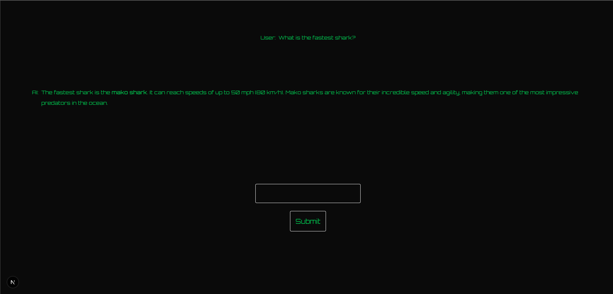

This is a web UI for running a local AI instance. The default AI is for an Ollama deepseek:14b instance.

## Getting Started

First, make sure your local AI is running. Then edit the provider in the route.ts file. Then, build the project:

```bash
npm run build
# or
yarn build
# or
pnpm build
# or
bun build
```
After that, run the project:

```bash
npm run start
# or
yarn start
# or
pnpm start
# or
bun start
```

Open [http://localhost:8080](http://localhost:8080) with your browser to see the result. If you're attemtping to access the local instance via a different device, you will need to use the IP address for the device running Shark UI. This will be unique to you.

